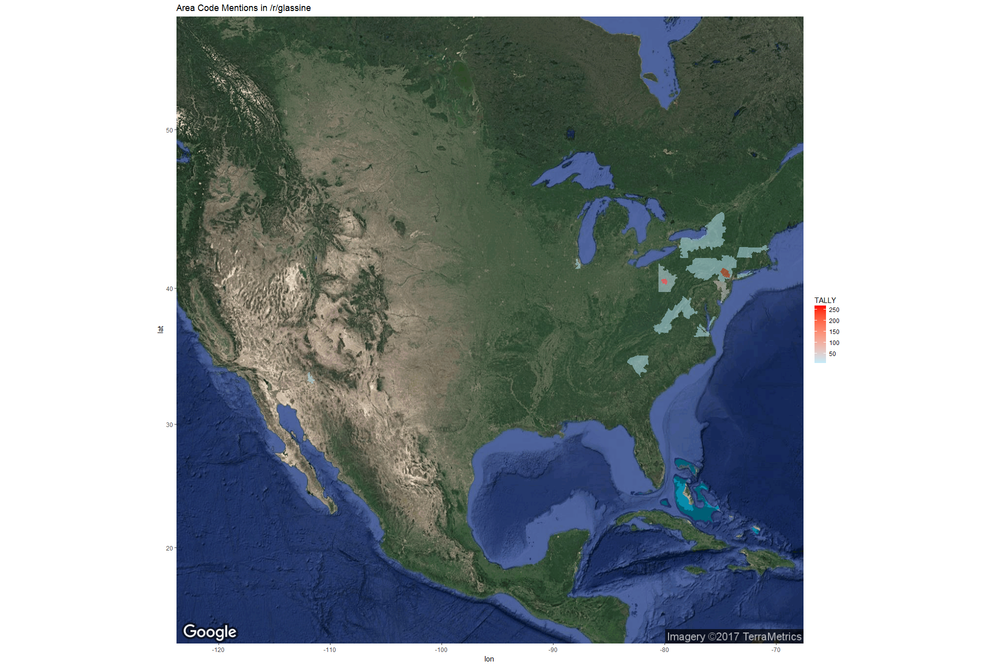
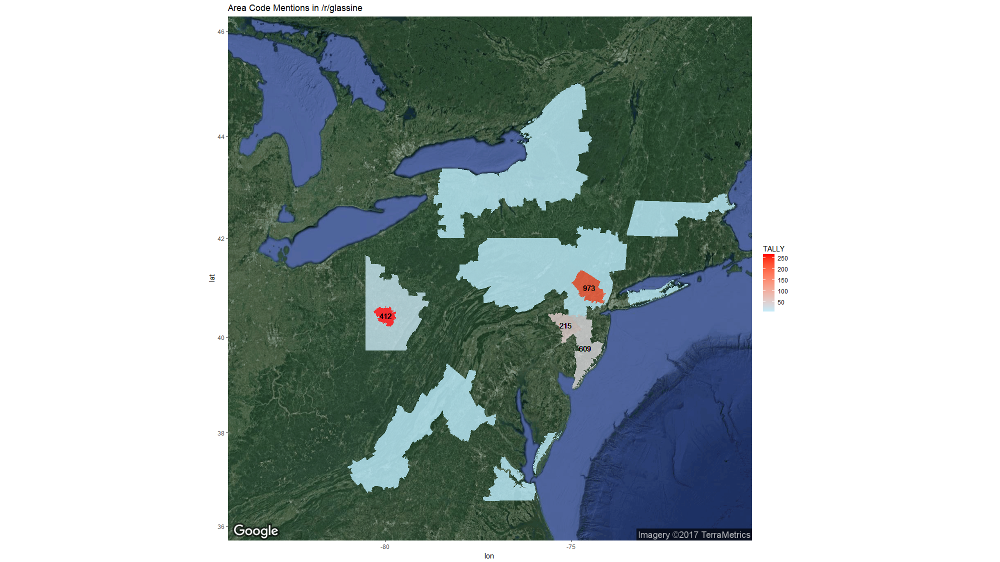

```{r setup, include=FALSE}
knitr::opts_chunk$set(echo = TRUE)
```

## Background and Motivation

The following is a fulfillment of a data visualization request on the subreddit [/r/DataVizRequests](https://www.reddit.com/r/DataVizRequests/), which is a subreddit devoted to creating visualizations of datasets. This particular request not only involved visualizing a dataset, but also generating the dataset in the first place. The dataset is of area codes mentioned in a heroin request and review subreddit and the visualization is a collection of shaded regions superimposed on top of a google map.

This was done for free as an exercise for my own edification. Kudos to the requester /u/VroooMoose for identifying an interesting line of research.


## Description of what /u/VroooMoose is looking for:

*Hello! I'm an EMT in one of the United States' hotbeds for heroin and opiate use, addiction, and overdoses.
I rarely go a couple of years without being affected within ~3 degrees of separation, I rarely go a shift of EMS without having an overdose, and I can't go through watching anything on TV without seeing at least 3 commercials addressing addiction. It is a massive problem.*

*I originally went to r/opiates so that I could get some insight from users from their perspectives since many of my coworkers have a blanket-attitude that they are all pieces of shit, but I believe that is painfully short-sighted.
From there, I discovered r/glassine, which is a board of Reviews, Discussions, or HAT (Has anyone tried?) threads on specific bags or "brands" of heroin. Glassine refers to the bags that heroin used to primarily come in, whereas plain plastic baggies has been more common in my experience in EMS. Glance through this [Vice](https://www.vice.com/en_us/article/nneyew/heroin-bag-art-dequincey-jynxie-interview) article for a quick visual idea.*

*I'm interested in creating a heatmap by Area Code (the most common way r/glassine identifies locations) to see how the locations vary for threads. While opiate use and addiction has become widely accepted as an epidemic around the country, I think it would be interesting to see where some geographic concentrations are.*

*Let me know if you have any questions!*

## Working Hypothesis

For now I am operating under the assumption that /r/glassine area code mentions are indicative of an area code's level of opiate use and abuse because the redditors frequenting the sub are representative of US opiate users. This assumption will fall apart. I will define this datasets biases and evaluate the extent to which it can provide useful insights. From there I will develop a new working hypothesis.

## Collect and Process /r/glassine Dataset

Because the dataset did not yet exist. I had to begin by collecting the area codes mentioned in /r/glassine. I used the RedditExtractoR R package to scrape the post titles, I used the stringr R package for extracting candidate area codes from post titles, and I used the knitr R package to display a frequency table.

Load the relevant libraries:
```{r}
library(RedditExtractoR)
library(stringr)
library(knitr)
```

Check whether the raw data is available in the working directory. If it isn't collect the data from the web.
```{r}

if (file.exists("glassine_urls.csv")) {
  glassine_urls <- read.csv("glassine_urls.csv")
} else {
  glassine_urls <- reddit_urls(subreddit = "glassine",page_threshold = 40)
}

if (file.exists("area_codes_by_state.csv")) {
  area_codes_by_state <- read.csv("area_codes_by_state.csv")
} else {
  sprintf("use URL to get xls file -- file.download() didn't work for me")
}

```
[Click here for the area codes by state table if the data loading failed](https://www.google.com/url?sa=t&rct=j&q=&esrc=s&source=web&cd=1&cad=rja&uact=8&ved=0ahUKEwi2lb79huDXAhWq0FQKHeQ0A9EQFggoMAA&url=http%3A%2F%2Fmedia.juiceanalytics.com%2Fdownloads%2Farea_codes_by_state.xls&usg=AOvVaw3xPwQBSxfXDIqjnq6etEWn)

Examine the glassine data to decide how to parse the content.
```{r}
kable(head(glassine_urls),booktabs=TRUE,caption='First few rows of glassine data')
```

The glassine data has 998 rows and 5 columns, with each row containing data for a single thread and each column representing a feature across all 998 threads. The features include:

* a **"date"** column, which is the date the thread was posted
* a **"num_of_comments"** column, which is the number of comments the thread had 
* a **"title"** column, which is the title of the thread
* a **"subreddit"** column, which is the subreddit the thread was posted to
* a **"url"** column, which is the url of  the thread

Of these columns, the **"title"** column is the most pertinent since it often contains the area code the poster wants information about. In order to generate a dataset of area code mentions, we will need to extract any possible area codes mentiond in the title. One parsing procedure might be to extract any three-digit number within the title column. This will produce an array of candidate area codes.

```{r}
candidate_area_codes<-str_extract(glassine_urls$title, "[0-9]{3}")
```

From this array we can calculate a frequency table for area code mentions:

```{r}
ac_tbl<-as.data.frame(sort(table(candidate_area_codes),decreasing=TRUE))
kable(ac_tbl,align='ccc')
```

Some of these candidates are not area codes; e.g. '007'. However, most candidates do have a corresponding area code. We can validate our candidates against the independent dataset from the **area_codes_by_state** data in the **Area.code** column. Here are the candidates that could not be validated with the external dataset:

```{r}
valid_ac<-ac_tbl$candidate_area_codes %in% area_codes_by_state$Area.code
kable(ac_tbl[!valid_ac,],align='ccc')
```

After removing the invalid candidates, the frequency table is ready to be used for constructing the cholopleth maps for /r/glassine mentions. Here is what the top five most frequently mentiond area codes are in the glassine dataset:

```{r}
valid_ac<-ac_tbl$candidate_area_codes %in% area_codes_by_state$Area.code
ac_tbl<-ac_tbl[valid_ac,]
kable(ac_tbl[1:5,],align='ccc',booktabs=TRUE)
```

##Collect and process shapefile data

Cholopleth maps shade different map regions according to a variable of interest. In this case, the shading will reflect the number of mentions a given area code has in the glassine dataset. But to shade a given map region we will have to first define its location. This involves finding data that delineates the extent of the area codes within USA.

I use a number of R packages for working with the shapefile. rgdal::readOGR is used for reading the shapefile into R. rgeos::gCentroid is used for finding the centroid of area code territories. sp/rgdal R packages have spTransform and CRS functions for map projection and datum transformation. The broom R package is useful for transforming spatial polygon dataframes into tidy dataframes for ggplot2. 

Load map-making libraries:
```{r}
# load up libraries:
library(sp)
library(rgdal)
library(broom)
library(rgeos)
```

Finding a shapefile for US area codes took some googling, but eventually I found one. I've uploaded the zip file to the [github repo](https://github.com/areeves87/glassine-area-codes) to make it easy for others to use. 

The following code chunk checks whether the Areacode.zip file is available in the working directory. If it isn't, it downloads the file from the web into the working directory. Then, it unzip the AreaCode.zip file to extract the AreaCode.shp file delineating the extent of each area code in lat,lon coordinates. Finally, it reads in the .shp file and then removes all extracted files to clear up space.

```{r}
if (file.exists("AreaCode.zip")) {
  unzip("AreaCode.zip")
  area <- readOGR("AreaCode.shp")
} else {
  download.file("https://www.sciencebase.gov/catalog/file/get/4f4e4a19e4b07f02db605716?facet=AreaCode","AreaCode.zip",mode="wb")
  unzip("AreaCode.zip")
  area <- readOGR("AreaCode.shp")
}

file.remove("AreaCode.dbf","AreaCode.prj","AreaCode.sbn",
            "AreaCode.sbx","AreaCode.shx","AreaCode.shp","AreaCode.shp.xml")
```

(I'm getting ahead of myself a bit here, but I'm including one more processing step on the frequency table. This is because of a plotting issue I run into later on with the maps. The essence of the problem is that these low-count area codes completely overlap with some high-count area codes, making it difficult to see the shading for the high-count area codes. There is probably a more elegant way of handling the problem. For now, here's the hard-coded step:)
```{r}
ac_tbl<-ac_tbl[!(names(ac_tbl) %in% c("267","862"))]
```


We only need a subset of the area codes contained in the shapefile, so let's select shapes only for area codes mentioned in the frequency table.
```{r}

glassine_area<-area[area$NPA %in% ac_tbl$candidate_area_codes,]
```

add a column of data indicating number of mentions per area code
```{r}

ac_ref<-match(glassine_area@data$NPA,ac_tbl$candidate_area_codes)
glassine_area@data$TALLY <- as.vector(ac_tbl[ac_ref,2])
```

Later, we are going to plot the area code for some of the glassine hotspots. For area code labels, use the centroid of an area code, which is found using a function in the rgeos package. Find lat,lon of centroids and add them as two columns of data.
```{r}

glassine_area$CENTER.x<-tidy(gCentroid(glassine_area, byid=TRUE))[,1]
glassine_area$CENTER.y<-tidy(gCentroid(glassine_area, byid=TRUE))[,2]
```

(Make proper transform -- I copied this next part from another tutorial and I'm not sure if this step is necessary:)
```{r}

glassine_WGS84 <- spTransform(glassine_area, CRS("+init=epsg:4326"))
glassine_df_WGS84 <- tidy(glassine_WGS84)
glassine_WGS84$polyID <- sapply(slot(glassine_WGS84, "polygons"), function(x) slot(x, "ID"))
glassine_df_WGS84 <- merge(glassine_df_WGS84, glassine_WGS84, by.x = "id", by.y="polyID")
```

## Cholopleth Maps of /r/glassine Dataset

Now we have shapes for the area codes we are interested in and a count for each area code mentioned on /r/glassine. We are ready to make our cholopleth maps!

For this step I use RColorBrewer to make the color gradient for the shadings, ggmap for retrieving google map images, and ggplot2 for making the shaded overlays.

```{r}
# load up libraries:
library(RColorBrewer)
library(ggplot2)
library(ggmap)
```

Create a cholopleth map of mainland USA
```{r, out.width='100%'}
if (file.exists("usa_glassine.png")) {
  
} else {
  usa_basemap <- get_map(location="United States", zoom=4, maptype = 'satellite')

ggmap(usa_basemap) +
        geom_polygon(data = glassine_df_WGS84, 
                     aes(x=long, y=lat, group = group, # coordinates, and group them by polygons
                         fill = TALLY), alpha = 0.5) + # variable to use for filling
        scale_fill_gradient(low="#bfefff",high="red")+
        ggtitle("Area Code Mentions in /r/glassine")
}

```

Create a cholopleth map of PA-NJ region
```{r, out.width='100%'}
if (file.exists("pa_glassine.png")) {
  
} else {
  pa_basemap <- get_map(location="PA", zoom=6, maptype = 'satellite')

ggmap(pa_basemap) +
        geom_polygon(data = glassine_df_WGS84, 
                    aes(x=long, y=lat, group = group, # coordinates, and group them by polygons
                        fill = TALLY), alpha = .8) + # variable to use for filling
        scale_fill_gradient(low="#bfefff",high="red")+
        geom_text(data = glassine_df_WGS84,aes(x=CENTER.x,y=CENTER.y,
                        label=ifelse(TALLY>20,as.character(NPA),'')))+
        ggtitle("Area Code Mentions in /r/glassine")
}


```

